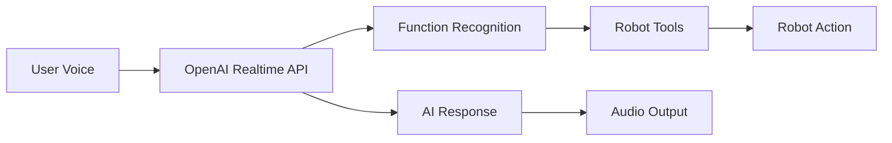
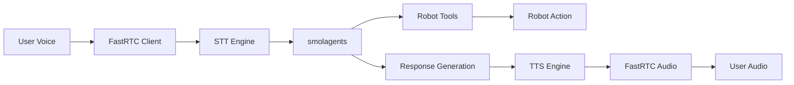

# 🤖 UR-HAL Voice Agents

[](https://www.python.org/downloads/)
[](https://opensource.org/licenses/MIT)
[](https://www.universal-robots.com/)

> **Robust voice-controlled interfaces for Universal Robots (UR) robotic arms using cutting-edge AI conversation and real-time audio streaming technology.**

## 🎯 Overview

**UR-HAL** (Universal Robot Human-AI Language) provides two state-of-the-art approaches to natural voice-controlled robot interaction:

### 🚀 Available Implementations

| Implementation | Technology Stack | Best For | Latency |
|---------------|------------------|----------|---------|
| **OpenAI Agents Voice** | OpenAI Realtime API | Production use, lowest latency | ~200-500ms |
| **FastRTC Hybrid** | FastRTC + smolagents | Custom models, flexibility | ~500-1000ms |

Both implementations feature:
- 🎙️ **Natural voice interaction** with conversational AI
- 🛡️ **Enterprise-grade safety** with wake word validation  
- 🔄 **Real-time audio streaming** for seamless communication
- 🤝 **Unified robot control** through shared tool interfaces
- 💬 **Personality-driven responses** with UR-HAL's witty character

## 🛡️ Safety Features

- **Wake Word Validation**: Robot commands require "timbra" for execution
- **Connection Monitoring**: Robust error handling and reconnection
- **Command Validation**: Comprehensive input validation and sanitization
- **Emergency Stop**: Always keep physical emergency stop accessible

## 🚀 Quick Start

### Prerequisites

- **Python 3.9+** with pip
- **Universal Robot** (UR3/UR5/UR10/UR16) with RTDE enabled
- **Network connectivity** between computer and robot
- **Microphone and speakers** for voice interaction
- **OpenAI API key** for AI functionality

### 1. 📋 Environment Setup

Create your environment configuration:

```bash
# Copy the example environment file
cp .env.example .env
```

Configure your `.env` file:

```bash
# Required Configuration
OPENAI_API_KEY=sk-your-openai-key-here

# Robot Configuration  
UR_ROBOT_IP=192.168.56.101          # Your robot's IP address

# Optional Configuration
MODE=CLI                             # CLI or WEB interface
OPENAI_MODEL_ID=gpt-4o-mini         # OpenAI model to use
WAKEWORD=timbra                     # Safety wake word
DEFAULT_SERVER_PORT=7860            # Web server port
DEBUG=false                         # Enable debug logging
```

### 2. 📦 Install Dependencies

Using pip:

```bash
pip install -r requirements.txt
```

Using uv (recommended for faster installs):

```bash
uv pip sync pyproject.toml
```

### 3. 🎯 Choose Your Implementation

#### Option A: OpenAI Agents Voice (Recommended)

**Best for**: Production use, lowest latency, built-in voice processing

```bash
# CLI Mode - Text-based testing
python demo_openai_agents_voice.py

# Web Mode - Full voice interface
MODE=WEB python demo_openai_agents_voice.py
```

#### Option B: FastRTC Hybrid

**Best for**: Custom models, flexibility, multi-provider support

```bash
# CLI Mode - Text-based testing  
python demo_fastrtc_hybrid.py

# Web Mode - Full voice interface
MODE=WEB python demo_fastrtc_hybrid.py
```

#### Option C: Cookbook Minimal

**Best for**: Quick experimentation and environments without audio.

```bash
python demo_cookbook_minimal.py
```

### 4. 🌐 Access Web Interface

When running in WEB mode, open your browser to:

```text
http://localhost:7860
```

**Features:**
- 🎤 Click-to-talk voice interface
- 📊 Real-time robot status display
- 🔊 Audio feedback and responses
- 📱 Mobile-friendly responsive design

## 🎤 Voice Commands Reference

UR-HAL responds to natural language commands with personality and intelligence. Here's your command reference:

### 🤖 Robot Control Commands (Require "timbra" wake word)

**Movement Commands:**

- "Move up 50 millimeters with timbra"
- "Move down 25mm timbra"
- "Go left 10 centimeters timbra"
- "Move forward 5cm with timbra"

**Position Commands:**

- "Go to home position timbra"
- "Send robot home timbra"
- "Return to starting position with timbra"

**Advanced Commands:**

- "Rotate joint 1 by 10 degrees timbra"
- "Move to coordinates X100 Y200 Z300 timbra"

### 📊 Status Commands (No wake word needed)

**Robot Status:**

- "What's the robot status?"
- "Get current position"
- "Show me the TCP pose"
- "How is the robot feeling?"

**System Information:**

- "What's your current mode?"
- "Show connection status"
- "Display robot capabilities"

### 💬 General Conversation (No wake word needed)

**Personality & Chat:**

- "How are you today?"
- "Tell me about yourself"
- "What can you do?"
- "What's your favorite robot joke?"

**Help & Information:**

- "What commands can I use?"
- "How do I move the robot?"
- "Explain the safety features"

> **💡 Pro Tip:** UR-HAL understands natural variations! You can say "timbra" anywhere in robot commands - beginning, middle, or end.

## 🏗️ Architecture & Implementation

### 🔧 Shared Components

All implementations share these core components for consistency:

| Component | Description | Location |
|-----------|-------------|----------|
| **Robot Tools** | Centralized robot control functions | `ur/robot_tools.py` |
| **AI Personality** | UR-HAL's character and response prompts | `ur/agents/shared_prompts.py` |
| **Web Interface** | Responsive voice-enabled UI | `index.html` |
| **Configuration** | Environment and runtime settings | `.env` |
| **Safety Layer** | Wake word validation and error handling | All modules |

### 🎯 OpenAI Agents Voice Architecture

**Flow Diagram:**


**Advantages:**

- ⚡ **Ultra-low latency** (~200-500ms end-to-end)
- 🎯 **Native function calling** with built-in tool support
- 🎤 **Advanced VAD** (Voice Activity Detection)
- 🔄 **Streaming audio** for real-time interaction
- 🛡️ **Enterprise reliability** with OpenAI infrastructure

**Trade-offs:**

- 🔒 **OpenAI dependency** - locked to their ecosystem
- 💰 **Usage costs** based on OpenAI pricing
- 🎛️ **Limited customization** of audio pipeline

### 🔄 FastRTC Hybrid Architecture

**Flow Diagram:**


**Advantages:**

- 🔄 **Model flexibility** - use any STT/TTS providers
- 🎛️ **Custom logic** for conversation flow
- 🌐 **Multi-provider** support (OpenAI, Anthropic, local models)
- 🔧 **Full pipeline control** for specialized use cases
- 💡 **Open source** components throughout

**Trade-offs:**

- 🐌 **Higher latency** (~500-1000ms end-to-end)
- 🔧 **Complex setup** with multiple dependencies
- 🛠️ **Maintenance overhead** for multiple components

## ⚙️ Configuration Guide

### 🔐 Environment Variables

Create a `.env` file in your project root with these settings:

| Variable | Default | Required | Description |
|----------|---------|----------|-------------|
| `OPENAI_API_KEY` | - | ✅ **Yes** | OpenAI API key (starts with `sk-`) |
| `UR_ROBOT_IP` | `192.168.56.101` | ✅ **Yes** | Your robot's IP address |
| `OPENAI_MODEL_ID` | `gpt-4o-mini` | ⚪ No | OpenAI model for AI responses |
| `MODE` | `CLI` | ⚪ No | Interface mode (`CLI` or `WEB`) |
| `WAKEWORD` | `timbra` | ⚪ No | Safety wake word for robot commands |
| `DEFAULT_SERVER_PORT` | `7860` | ⚪ No | Web server port |
| `DEBUG` | `false` | ⚪ No | Enable detailed debug logging |

### 🤖 Robot Configuration Checklist

Before running UR-HAL, ensure your Universal Robot meets these requirements:

**Network Setup:**
- ✅ Robot connected to same network as computer
- ✅ Static IP address configured (recommended)
- ✅ Network firewall allows RTDE communication
- ✅ Ping test successful: `ping <robot_ip>`

**Robot Settings:**
- ✅ RTDE (Real-Time Data Exchange) enabled
- ✅ Robot in operational state (not emergency stopped)
- ✅ Teach pendant accessible for emergency stop
- ✅ Clear workspace around robot

**Safety Verification:**
- ✅ Emergency stop button functional and accessible
- ✅ Safety barriers/fencing in place if required
- ✅ Personnel trained on robot safety procedures
- ✅ Risk assessment completed for voice control

### 🔧 Advanced Configuration

**Custom Wake Words:**
```bash
# Change the safety wake word
WAKEWORD=custom_trigger_word
```

**Model Selection:**
```bash
# Use different OpenAI models
OPENAI_MODEL_ID=gpt-4o-mini      # Fast, cost-effective
OPENAI_MODEL_ID=gpt-4o           # Higher quality, slower
```

**Network Configuration:**
```bash
# Custom port for web interface
DEFAULT_SERVER_PORT=8080

# Multiple robot support (future feature)
UR_ROBOT_IP_PRIMARY=192.168.1.100
UR_ROBOT_IP_SECONDARY=192.168.1.101
```

**Development Settings:**
```bash
# Enable debug mode for troubleshooting
DEBUG=true

# CLI mode for development without audio
MODE=CLI
```

**Voice Agent Configuration:**
```bash
# Voice interaction settings (for OpenAI agents)
TEXT_ONLY_MODE=false          # Use text-only mode (disable voice)
ENABLE_TEXT_INPUT=true        # Allow text input alongside voice  
ENABLE_INTERRUPTION=true      # Allow interrupting assistant speech
POST_SPEECH_DELAY=0.1         # Delay after speaking (seconds)
THREADED_TOOLS=true           # Execute robot tools in background
ENABLE_LOGGING=false          # Enable session logging

# SmolAgent specific settings
MODEL_PROVIDER=openai         # AI provider (openai, huggingface)
MODEL_ID=gpt-4o-mini         # Model to use
THREADED_CODE_EXECUTION=true  # Execute generated code in threads
MAX_STEPS=10                  # Max steps for SmolAgent
VERBOSE_AGENT=true            # Verbose SmolAgent output
ENABLE_TTS=false              # Enable text-to-speech responses
```

## 🧪 Testing & Validation

### 🖥️ CLI Mode Testing

CLI mode provides a safe, text-based environment for testing commands without audio:

```bash
# Test OpenAI Agents Voice implementation
python demo_openai_agents_voice.py

# Test FastRTC Hybrid implementation  
python demo_fastrtc_hybrid.py
```

**Example CLI Session:**
```text
UR-HAL> move up 50mm with timbra
✅ Moving up 50mm... Watch this smooth operator work!
✅ Movement completed successfully

UR-HAL> status
📊 Robot Status: Online | Position: [X:234.5, Y:156.7, Z:89.2] | Mode: Normal

UR-HAL> go home timbra
🏠 Home sweet home! Returning to my favorite position...
✅ Homed successfully

UR-HAL> what can you do?
💪 I'm UR-HAL, your robotic assistant! I can move, rotate, go home, 
   check status, and chat about robotics. Always use 'timbra' for 
   movement commands - safety first!

UR-HAL> exit
👋 Goodbye! Keep those robots moving safely!
```

### 🌐 Web Mode Testing

Web mode provides the full voice-enabled experience:

1. **Start Web Interface:**
   ```bash
   MODE=WEB python demo_openai_agents_voice.py
   ```

2. **Access Browser Interface:**
   Navigate to: `http://localhost:7860`

3. **Test Voice Commands:**
   - Click the microphone button
   - Speak clearly: "Move up 25mm with timbra"
   - Wait for audio response and visual feedback

### 🔍 Connection Testing

**Test Robot Connection:**
```bash
# Basic network connectivity
ping 192.168.56.101

# Test RTDE connection (if available)
python -c "from ur.bridge import URBridge; ur = URBridge('192.168.56.101'); print('Connected!' if ur.connect() else 'Failed!')"
```

**Test OpenAI API:**
```bash
# Verify API key and model access
python -c "import openai; openai.api_key='your-key'; print('API OK' if openai.models.list() else 'API Failed')"
```

### 🎯 Automated Testing

Run the comprehensive test suite:

```bash
# Run all connection tests
python samples/tests/test_rtde_connection.py
python samples/tests/test_ollama_connection.py

# Test voice agent functionality
python samples/voice_agents/test_unified_agent.py

# Test immediate response system
python samples/voice_agents/test_immediate_responses.py
```

### 📊 Performance Testing

**Latency Measurement:**
```bash
# Enable performance logging
DEBUG=true python demo_openai_agents_voice.py

# Look for timing information in logs:
# [INFO] Command processed in 245ms
# [INFO] Audio response in 156ms  
# [INFO] Robot movement completed in 1.2s
```

**Load Testing:**
```bash
# Test multiple rapid commands (CLI mode recommended)
for i in {1..10}; do
    echo "status" | python demo_openai_agents_voice.py
done
```

## 🔍 Troubleshooting Guide

### 🚨 Common Issues & Solutions

#### API Key Problems

**Issue:** "Invalid or missing OPENAI_API_KEY"

**Solutions:**
- Ensure API key is set in `.env` file
- Verify key starts with `sk-` prefix
- Check for extra quotes or spaces in `.env`
- Test key with: `echo $OPENAI_API_KEY` (should show your key)

#### Robot Connection Issues

**Issue:** "Failed to connect to robot"

**Solutions:**
- Verify robot IP address is correct
- Check network connectivity: `ping <robot_ip>`
- Ensure RTDE is enabled on robot
- Confirm robot is not in emergency stop
- Try restarting robot control software

#### Wake Word Issues

**Issue:** "Wake word required" or commands ignored

**Solutions:**
- Include "timbra" in robot movement commands
- Status/chat commands don't need wake word
- Check pronunciation in web mode audio
- Verify wake word setting in `.env`: `WAKEWORD=timbra`

#### Web Interface Issues

**Issue:** Web interface not loading

**Solutions:**
- Check port is available (default 7860)
- Try different port: `DEFAULT_SERVER_PORT=8080 MODE=WEB python demo_openai_agents_voice.py`
- Check firewall settings allow local connections
- Verify no other services using the port

### 🔧 Debug Mode

Enable comprehensive debug logging:

```bash
DEBUG=true python demo_openai_agents_voice.py
```

**Debug output includes:**
- Detailed error messages and stack traces
- API request/response logging
- Robot communication details
- Audio processing information
- Performance timing data

## 🔌 Hardware Requirements

### Robot
- Universal Robots UR3/UR5/UR10/UR16 series
- RTDE interface enabled
- Network connectivity

### Computer
- Python 3.9+
- Microphone and speakers (for voice mode)
- Network connection to robot
- Sufficient processing power for real-time audio

## 📈 Performance

### OpenAI Agents Voice
- **Latency**: ~200-500ms end-to-end
- **Audio Quality**: Excellent (16kHz PCM)
- **Reliability**: High

### FastRTC Hybrid  
- **Latency**: ~500-1000ms end-to-end
- **Audio Quality**: Good (configurable)
- **Reliability**: Good (depends on STT/TTS models)

## 🛠️ Development

### Adding New Robot Functions

1. Add function to `ur/robot_tools.py`:
```python
@tool
def my_new_function(param: str) -> Dict[str, Any]:
    # Implementation
    pass
```

2. Update `OPENAI_TOOLS_SPEC` for OpenAI Realtime

3. Add to smolagents tools list in FastRTC version

### Customizing AI Personality

Edit `ur/agents/shared_prompts.py`:
- Modify `BASE_SYSTEM_PROMPT`
- Add new response categories
- Update personality traits

### Adding New Interface Modes

1. Create new handler class
2. Add mode to environment configuration
3. Update main() function routing

## Immediate Response System

The voice agents now include an **immediate response system** that provides instant feedback when robot commands are received, before the command is actually executed. This improves user experience by:

- **Instant Acknowledgment**: Users get immediate confirmation that their command was heard and understood
- **Better Flow**: No awkward silence while waiting for robot execution to complete
- **Safety Feedback**: Clear indication when wake word validation fails
- **Personality**: Maintains UR-HAL's witty personality even in immediate responses

### How It Works

1. **Command Recognition**: When a robot command is detected, an immediate acknowledgment is sent
2. **Wake Word Check**: If the wake word "timbra" is missing, an immediate reminder is given
3. **Execution**: The actual robot command executes in the background
4. **Final Response**: A completion message is sent after execution

### Immediate Response Types

- **Movement Commands**: "Moving as requested! Watch this smooth operator work..."
- **Home Commands**: "Home sweet home! Returning to my favorite position..."
- **Status Commands**: "Status check initiated! Let me see how I'm feeling..."
- **General Commands**: "Command received! Let me work my magic..."

### Testing

Run the test script to see immediate responses in action:

```bash
python samples/voice_agents/test_immediate_responses.py
```

### Integration

The system works with both voice agent implementations:

- **FastRTC Hybrid**: Uses audio queue for immediate voice responses
- **OpenAI Realtime**: Integrates with the conversation flow
- **CLI Mode**: Shows immediate text responses in console

## 📝 License

MIT License - see LICENSE file for details.

## 🤝 Contributing

1. Fork the repository
2. Create feature branch
3. Add tests for new functionality
4. Submit pull request

## 📞 Support

For issues and questions:
- Check troubleshooting section
- Enable debug mode for detailed errors
- Verify robot connection independently
- Test with CLI mode first

## 🔄 Updates

### v1.0.0
- Initial release
- OpenAI Realtime and FastRTC implementations
- Shared robot tools and prompts
- CLI and Web interfaces
- Comprehensive error handling
